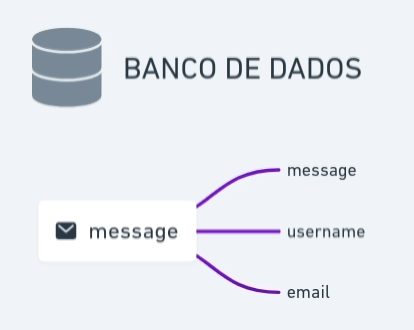

  

&nbsp;

  <a href="#techs">Tecnologias</a>&nbsp;&nbsp;&nbsp;|&nbsp;&nbsp;&nbsp;
  <a href="#project">Projeto</a>&nbsp;&nbsp;&nbsp;|&nbsp;&nbsp;&nbsp;
  <a href="#how-use">Como executar</a>&nbsp;&nbsp;&nbsp;|&nbsp;&nbsp;&nbsp;
  <a href="#mit">Licença</a>

&nbsp;&nbsp;&nbsp;

## ✨ Tecnologias

Esse projeto foi desenvolvido com as seguintes tecnologias:

- [Elixir](https://elixir-lang.org/)
- [Phoenix](https://phoenixframework.org/)
- [Ecto](https://hexdocs.pm/ecto/Ecto.html)

## 💻 Projeto

Gerador de nuvens de tags mais ocorrentes

  

&nbsp;&nbsp;&nbsp;

## 🚀 Como executar

- Clone o repositório com `git clone https://github.com/joaopealves/heat_tags.git`
- Instale as dependencias do projeto `mix deps.get`
- Inicie o setup inicial do banco de dados com `mix ecto.setup`
- Inicie o servidor do phoenix `mix phx.server`

`Obs: Caso precise você pode alterar as configurações de senha e usuário do banco de dados nos arquivos config/dev.exs e no arquivo config/test.exs`

Por fim, a aplicação estará disponível em `http://localhost:4000`

---

## 📄 Licença

Esse projeto está sob a licença MIT. Veja o arquivo [LICENSE](LICENSE.md) para mais detalhes.

<h1 align="center">
    
</h1>

&nbsp;

Feito com 💜 by Rocketseat 👋🏻 [Participe da nossa comunidade!](https://discordapp.com/invite/gCRAFhc)

